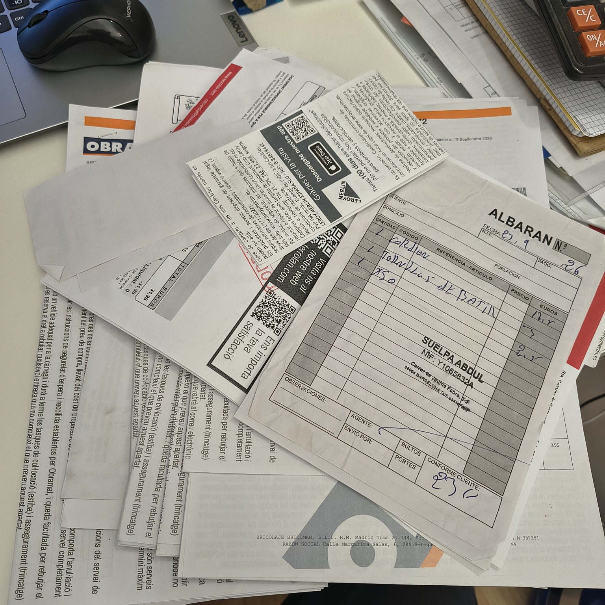
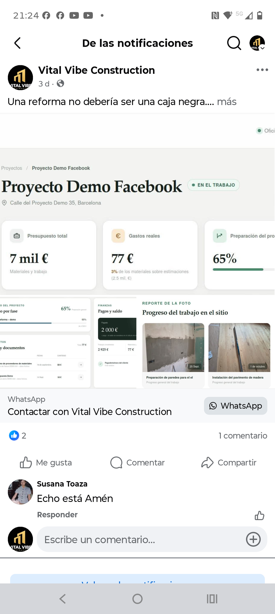

# Как следить за ремонтом и понимать, на что уходят деньги

Во время ремонта хочется понимать, что уже сделано, на что потрачены деньги и сколько ещё потребуется до завершения.

Наши клиенты бесплатно получают доступ к личному кабинету. В нём можно следить за ходом работ, смотреть фотографии, расходы на материалы и внесённые платежи. По мере ремонта информация обновляется, а изменения стоимости можно сопоставить с первоначальной сметой.

За этими цифрами стоят конкретные покупки и решения. Покажем на примере одного ремонта, как они попадают в расчёт.

## Почему недостаточно просто сложить чеки

Пять мешков плиточного клея по 14 € — это 70 €. Казалось бы, понятный расход.

Но в смете был клей одного производителя, а купили другого. Это замена для той же работы? Понадобилось больше материала? Или изменился способ укладки?

От ответа зависит пересчёт. При замене нужно обновить прежнюю позицию. При изменении работ — учесть, что добавилось и что больше не потребуется. Иначе купленный материал может попасть в расчёт дважды, а отменённый — остаться в итоговой цене.

За несколько месяцев ремонта таких изменений набираются десятки.

## Пол залит — обновляем расчёт

При подготовке пола была предусмотрена одна выравнивающая смесь. Фактически купили два состава Capafloor для разной толщины слоя: 16 мешков одного и 6 другого.

Материалы для этой работы уже были заложены в смету. Поэтому закупку нужно сопоставить с прежней позицией и пересчитать стоимость, сохранив исходный расчёт для сравнения.

Каждый чек входит в учёт проекта: что купили, для какой работы и за сколько. Это касается и крупных закупок, и небольших расходов на грунтовку, фитинги или расходники.

Подробности подготовки основания и стоимость работ можно посмотреть в [статье о подготовке пола и укладке паркета](https://vitalvibeconstruction.com/ru/articles/podgotovka-pola-parket-barselona-stoimost/).

Каждый чек — часть стоимости ремонта. В том числе покупка на несколько евро.

## Изменения могут увеличивать и уменьшать цену

В этом ремонте вместо первоначально предусмотренного SPC выбрали инженерный паркет. Стоимость покрытия выросла на 1 847,72 €.

Другие решения уменьшили расходы. Отказ от прежнего отопительного контура убрал из расчёта 472,05 € материалов. А подготовка стен на 400 € осталась внутри первоначального объёма и не стала дополнительной оплатой.

Смета меняется вместе с проектом: в неё входят новые позиции, из неё вычитаются отменённые, плановые цены уточняются по закупкам. В этом случае она прошла пять версий. При этом сохранилась возможность вернуться к первой и объяснить разницу.

## Когда нужен подробный отчёт

По просьбе клиента мы подготовили разбор изменения стоимости. Первая смета составляла 19 532,77 €, а промежуточный расчёт на 23 сентября — 23 144,40 €.

Разницу в 3 611,63 € разложили по причинам: замены материалов, изменения работ, доставки и экономия. Суммы, ещё требующие проверки или согласования, отметили отдельно. Промежуточный расчёт не выдаётся за окончательную цену.

## Что это даёт вам

В личном кабинете можно следить за текущим состоянием ремонта, не собирая его историю из переписки: видеть выполненные работы, фотографии, расходы и платежи.

Если стоимость меняется, есть основа для предметного разговора — конкретная покупка или изменение объёма работ. При необходимости из этих данных готовится подробный отчёт.

Учёт помогает смотреть и вперёд: уже купленные материалы учитываются по фактической стоимости, оставшиеся закупки и работы — в расчёте предстоящих расходов. Поэтому вы можете понимать не только, сколько уже потрачено, но и сколько ещё потребуется для завершения ремонта.

Пример личного кабинета: ход работ, расходы, платежи и фотографии в одном месте. На скриншоте демонстрационный проект.
